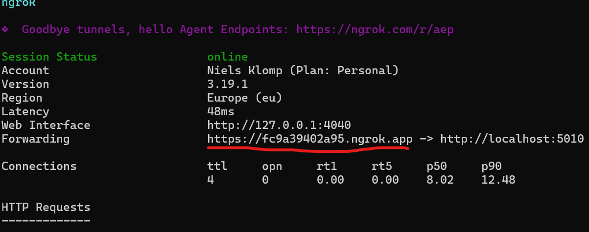

## Docker and docker compose
The agent can be run using docker compose. It uses volumes for both the configuration files and the default sqlite database.


## Ngrok

We need to have a reverse proxy installed that terminates TLS for us. Meaning that the agent will be exposed on a https:// endpoint. This ensures
that the wallet actually will be able to access your agent, as the store versions do not allow access over an unsecured connection.

<Info>Of course you can also use a reverse proxy like for instance Nginx and use your own certificates to perform the TLS termination</Info>


Download ngrok from the internet. Make sure it runs and listens for port 5010 locally. That is the default port the agent will use for the REST APIs.

```shell
ngrok http 5010
```

You now should see a screen like:



Make sure to copy the URL that is similar to the red underlined url. You will need it during the configuration steps


## Configure the agent
You first need to [configure the agent](/exercises/agent/configure). The default config files should be a good starting point. You mainly need to adjust the external URL and point the `CONF` env var to the correct `conf` folder location.

## Start the agent for the first time

Let's start the agent for the first time.

```shell
docker compose run
```

You should see console logs appearing. If the agent encounters an error, which is expected at this point, as we haven't configured it yet, it will
exit with an error.
