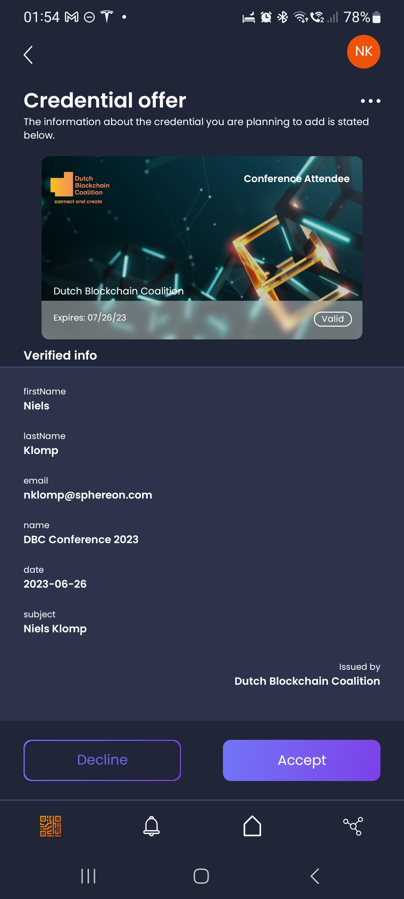

# Credential Branding in Verifiable Credentials

Credential branding is an essential aspect of Verifiable Credentials (VCs) that helps define how a credential is displayed and identified to end-users. It plays a crucial role in creating a user-friendly and consistent experience for individuals who interact with verifiable credentials. In this explanation, we give you a detailed account of the concept of credential branding as defined in the [Verifiable Credentials Issuance (VCI) spec](https://openid.net/specs/openid-4-verifiable-credential-issuance-1_0.html) specification. It provides a framework for controlling the appearance of a credential through its metadata. This metadata enables issuers to tailor the presentation along with localized adaptations, making credentials immediately identifiable to users regardless of their language or regional preferences.

An example of a branded credential in the Sphereon wallet:



# Key Elements of OID$VC Issuer metadata Credential Branding

Credential branding in OID4VCI is implemented through several metadata parameters defined by the credential issuer or in case of SD-JWT it can be expressed in the so called VCT document. These parameters allow for comprehensive customization visual details:

- **Display Name**
A human-readable name for the credential that appears to the end user. This required element serves as the primary identifier for the credential.

- **Locale-Specific Customization**
To address the needs of users across diverse regions and languages, display properties can be localized. Each display object can include a `locale` parameter (e.g., `"en-US"`, `"es-ES"`), ensuring that not only the overall credential title but also individual claim labels and descriptions are presented in the user’s preferred language. Each locale-specific object must be unique within the array.

- **Claim Labeling**
Beyond the overall credential name, individual claims within the credential can include locale-specific display names. For instance, if the credential includes a claim such as "firstName," it can be displayed as "First Name" in English, "Nombre" in Spanish, or "Prénom" in French, in accordance with the corresponding display configuration.

- **Logos and Alternative Text**
Issuers may include a logo as part of the branding details. The logo’s JSON object typically contains:
- **URL:** The link to the hosted image. It is important that the provided URL is accessible to all parties using the credential.
- **Alt Text:** A descriptive text that serves as an alternative should the logo fail to load, ensuring accessibility.

- **Background Images and Colors**
Credential metadata supports the use of background images and custom color schemes:
- **Background Image:** A URL for a rectangular image that will be used as the background of the credential. Note that the image should be provided without rounded corners as the rendering library will manage this styling.
- **Background Color & Text Color:** CSS-compliant color values that dictate the visual theme of the credential. These parameters help ensure that the credential’s design aligns with the issuer’s branding standards.

- **Descriptions**
A brief explanation of the credential can be included in the display metadata. This description may also be localized to enhance clarity for users in different regions.

# Practical Example: Credential Branding in Action

Consider a real-world example where a conference credential is configured with comprehensive branding details. The issuer’s metadata may include a `credential_configurations_supported` object with a display array that outlines all the visual elements. For example:

```json
{
  ...
  "credential_configurations_supported": {
    "ConferenceExample": {
      ...
      "display": [
        {
          "name": "Conference Attendee",
          "description": "The DBC Conference Attendee credential is given to all visitors of the DBC conference.",
          "background_color": "#3B6F6D",
          "text_color": "#FFFFFF",
          "logo": {
            "url": "https://dutchblockchaincoalition.org/assets/images/icons/Logo-DBC.png",
            "alt_text": "An orange block shape, with the text Dutch Blockchain Coalition next to it, portraying the logo of the Dutch Blockchain Coalition."
          },
          "locale": "en_us",
          "background_image": {
            "url": "https://i.ibb.co/CHqjxrJ/dbc-card-hig-res.png",
            "alt_text": "Connected open cubes in blue with one orange cube as a background of the card"
          }
        }
      ],
      ...
    }
  },
  ...
}
```

In this example:

- The credential is identified as **"Conference Attendee"**.
- A detailed **description** provides context about the credential.
- **Background** and **text colors** are specified to align with the credential's theme.
- A **logo** is provided with both a URL and alternative text.
- A **background image** adds an additional layer of visual branding.
- The **locale** key indicates that this set of display properties is tailored for users targeting the `"en_us"` locale.

# Enhancing the User Experience

By leveraging these customizable display options, credential issuers can fine-tune the presentation of credentials to meet cultural and regional preferences. Whether through localized text, region-specific images, or custom color schemes, these details not only enhance the visual appeal but also strengthen user trust and recognition in the credential’s authenticity.

For further details and technical definitions, please refer to the [OID4VCI specification](https://openid.net/specs/openid-4-verifiable-credential-issuance-1_0-13.html).